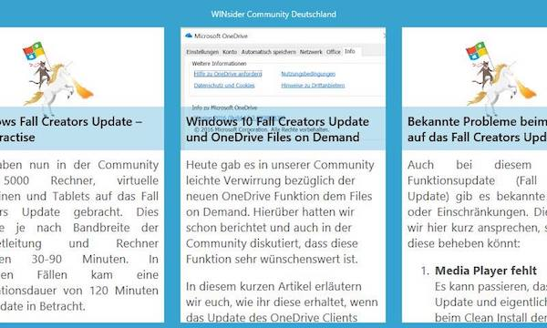
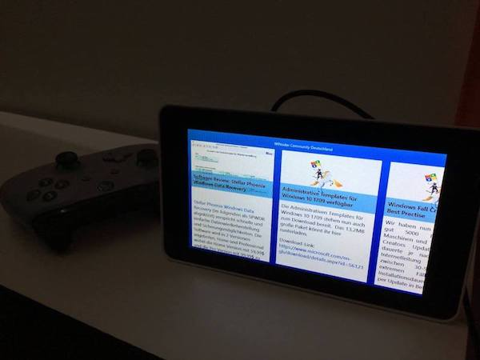

# windowscommunity.de – Microsoft Windows 10 IoT Core Sample App

This is a sample app that presents the latest news of the [Deusche Windows Insider Community](http://windowscommunity.de). The app is optimized to run by using the offical Raspberry Pi 7" Touchscreen attached to a RasberryPi 3.
Until the related blog posts are finished, the app is work in progress.

### Prerequisites
* Windows 10 ioT Core >= Build 16299
* Windows 10 PC
* Visual Studio 2017
* RaspberryPi needs an internet connection
* RaspberryPi needs an attached monitor

### How it looks

### How to run

Waiting for related blog posts ...

## License

This project is licensed under the MIT License - see the [LICENSE](LICENSE) file for details.
Dependencies or assets maybe licensed differently.